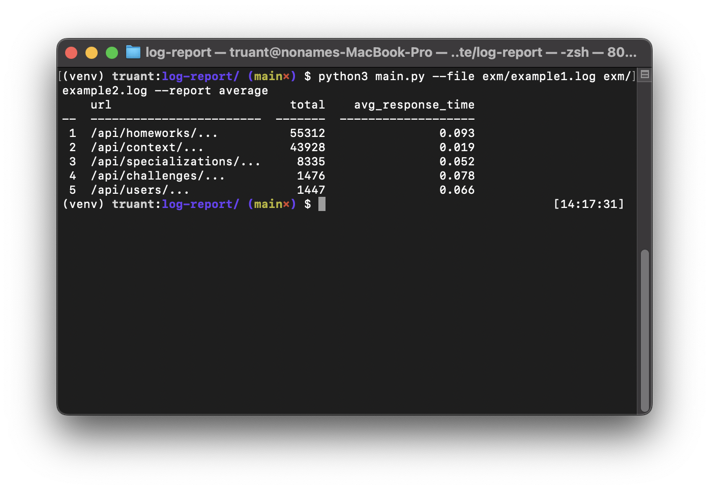
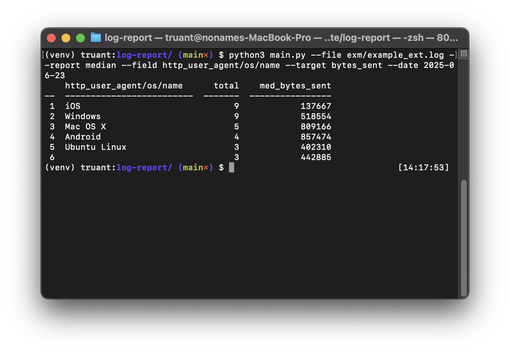
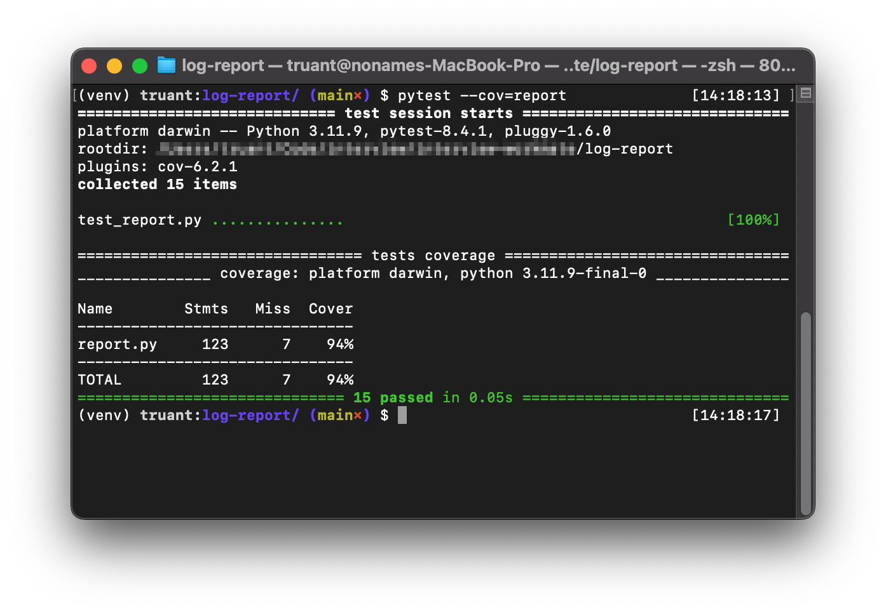

[English](/README.md) | [Русский](/README.ru.md)

---

# Установка

```bash
git clone https://github.com/etchedheadplate/log-report.git
python3 -m venv venv
source venv/bin/activate
pip install -r requirements.txt
```

# Использование
```bash
python3 main.py --file FILE [FILE ...] [--report {average,median}] [--field FIELD] [--target TARGET] [--date DATE]
```

# Примеры

## По умолчанию

Генерирует отчёты с усреднённым значением `{response_time}`, сгруппированные по уникальным записям `{url}` из JSON лог-файлов:

```bash
python3 main.py --file exm/example1.log exm/example2.log --report average
```



## Сложный пример

Генерирует отчёты с медианным значением `{bytes_sent}`, сгруппированные по `{http_user_agent}/{os}/{name}` для определённой даты:

```bash
python3 main.py --file exm/example_ext.log --report median --field http_user_agent/os/name --target bytes_sent --date 2025-06-23
```



# Создание новых отчетов

Чтобы добавить новые типы отчётов, реализуйте новый метод в классе `ReportGenerator`, имя которого начинается с `report_`. Метод должен вызывать `self._print_report(table_data, headers)` с соответствующими данными, отформатированными для библиотеки `tabulate`.

# Тестирование

```bash
pytest --cov=report
```



# Лицензия

MIT License
